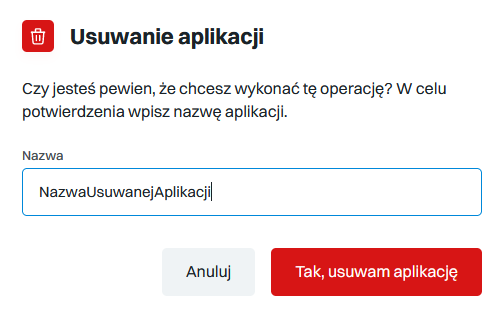

# Aplikacje

W tej zakładce mamy zebrane wszystkie aplikacje w naszej organizacji.

Z tego poziomu możemy zarządzać naszymi aplikacjami oraz tworzyć nowe instancje zapraszając  do nich użytkowników z naszej organizacji, bądź użytkowników spoza systemu.

## Dodawanie Aplikacji

Aby dodać nową instancję wystarczy kliknąć w przycisk Dodaj Aplikację.

.PNG>)

Na ekranie pojawi się nam okno tworzenia aplikacji. Aby poprawnie stworzyć nową aplikację wystarczy wybrać typ aplikacji, nadać jej nazwę (bez białych znaków oraz znaków diakrytycznych) oraz wybrać język aplikacji.(Włoski, Angielski bądź Polski).&#x20;

## Dodawanie użytkowników do aplikacji

Aby dodać użytkowników do aplikacji należy przejść do widoku szczegółowego aplikacji. Należy kliknąć w listę rozwijaną obok nazwy aplikacji oraz wybrać Pokaż szczegóły.

## Usuwanie aplikacji

