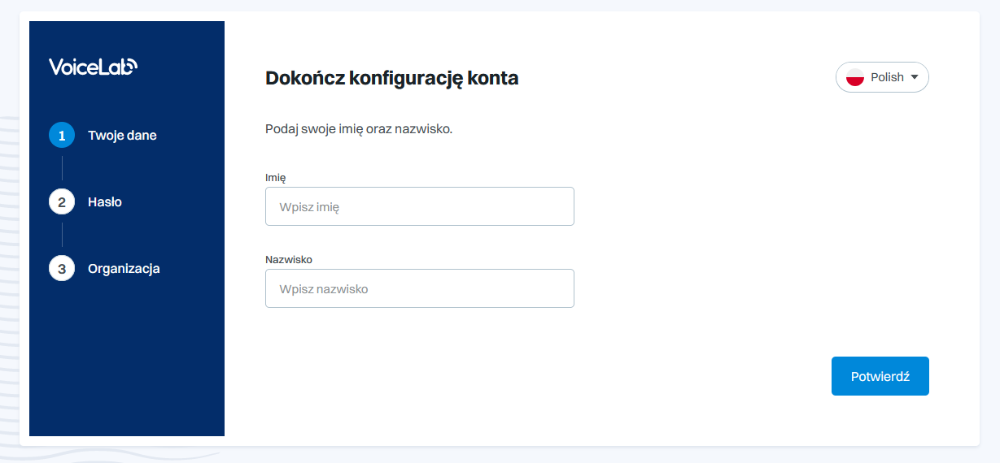

# Pierwsze kroki w RI

## Rejestracja

Na początek należy się zarejestrować do naszej aplikacji.&#x20;



Link przekieruje Cię do strony głównej naszej aplikacji. Następnie poprzez przycisk _<mark style="color:blue;">**Sign up for free **</mark>_przejdź do naszego formularza rejestracyjnego.

Wypełnij formularz podając swoje imię, nazwisko, hasło oraz nazwę organizacji.

Po poprawnym wypełnieniu formularz twoje konto zostanie utworzone.

## Logowanie

Po utworzeniu konto pozostaje już tylko zalogowanie się do naszej aplikacji.

## Strona Główna

Po poprawnym zalogowaniu do aplikacji wyświetli się strona główna. W prawym górnym rogu mamy możliwość zmiany języka aplikacji oraz możliwość zobaczenia naszych danych. Po lewej stronie znajduje się pole zakładek, które pomoże nam poruszać się po aplikacji.

